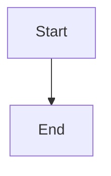
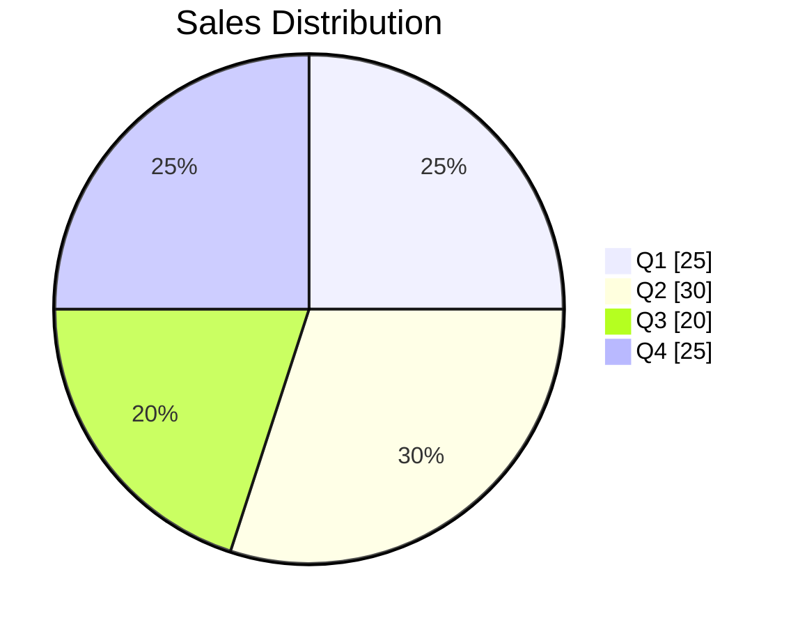
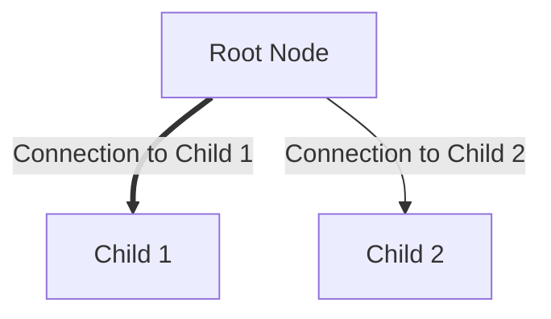
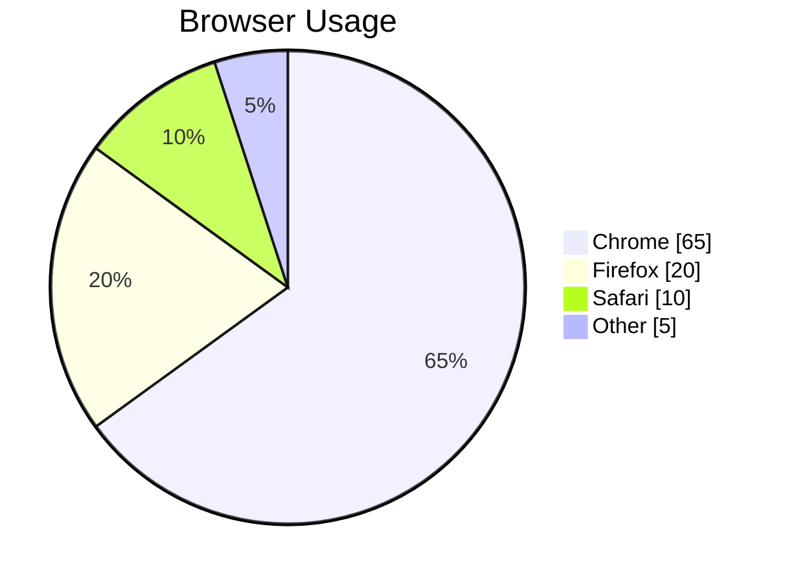

# MermaidJSON

Create Mermaid diagrams from JSON data

## Installation

```bash
bun install mermaid-json
# or
npm install mermaid-json
# or
yarn add mermaid-json
```

## Supported Diagrams

- Flowchart
- PieChart
- More coming soon!

## Quick Start

### Flowchart Example

```typescript
import { generateMermaidDiagram } from 'mermaid-json';

const flowchartGraph = {
  graphType: 'flowchart',
  direction: 'TD',
  nodes: [
    {
      id: 'start',
      label: 'Start',
      children: [
        {
          id: 'stop',
          label: 'End',
          lineType: 'Arrow'
        }
      ]
    }
  ]
};

const diagram = generateMermaidDiagram(flowchartGraph);
console.log(diagram);
```



### Pie Chart Example

```typescript
import { generateMermaidDiagram } from 'mermaid-json';

const pieGraph = {
  graphType: 'pie',
  title: 'Sales Distribution',
  showData: true,
  nodes: [
    { label: 'Q1', value: 25 },
    { label: 'Q2', value: 30 },
    { label: 'Q3', value: 20 },
    { label: 'Q4', value: 25 }
  ]
};

const diagram = generateMermaidDiagram(pieGraph);
console.log(diagram);
```



## API Reference

### Types

```typescript
// Base types
type GraphType = 'flowchart' | 'pie';
type Direction = 'TB' | 'TD' | 'BT' | 'RL' | 'LR';
type LineType = 'Arrow' | 'Open' | 'Thick' | 'Dotted' | 'Invisible';
type FlowchartNodeShape = "rect" | "round-rect" | "circle" | "ellipse" | "stadium" | 
                         "subroutine" | "cylinder" | "diamond" | "hexagon" | 
                         "left-parallelogram" | "right-parallelogram" | 
                         "trapezoid-top" | "trapezoid-bottom" | "odd";

// Discriminated union for different graph types
type MermaidGraph = {
  mermaidConfig?: MermaidConfig;
  classDefs?: Record<string, ClassDef>[];
} & (
  | {
      graphType: 'flowchart';
      direction: Direction;
      nodes: FlowchartNode[];
    }
  | {
      graphType: 'pie';
      title?: string;
      showData?: boolean;
      nodes: Array<{ label: string; value: number }>;
    }
);

// Flowchart-specific types
interface FlowchartNode {
  id: string;
  label: string;
  shape?: FlowchartNodeShape;
  children?: (FlowchartNode & FlowchartConnectionOptions)[];
  className?: string;
  styleProps?: Record<string, any>;
}

interface FlowchartConnectionOptions {
  connectionLabel?: string;
  lineType: LineType;
}
```

### Functions

#### `generateMermaidDiagram(graph: MermaidGraph): string`

Converts a MermaidGraph object to Mermaid diagram syntax.

**Parameters:**

- `graph` - A MermaidGraph object (flowchart or pie chart)

**Returns:** String containing the Mermaid diagram syntax

#### `saveMermaidDiagram(filepath: string, data: MermaidGraph): void`

Saves a MermaidGraph as a markdown file with proper Mermaid code blocks.

#### `loadMermaidJSON(filepath: string): MermaidGraph | null`

Loads Mermaid JSON data from a file.

#### `saveMermaidJSON(filepath: string, data: MermaidGraph): void`

Saves Mermaid JSON data to a file.

## Examples

### Basic Flowchart

```typescript
const flowchartExample: MermaidGraph = {
  graphType: 'flowchart',
  direction: 'TD',
  nodes: [
    {
      id: 'root',
      label: 'Root Node',
      children: [
        {
          id: 'child1',
          label: 'Child 1',
          connectionLabel: 'Connection to Child 1',
          lineType: 'Thick'
        },
        {
          id: 'child2',
          label: 'Child 2',
          connectionLabel: 'Connection to Child 2',
          lineType: 'Arrow'
        },
      ],
    }
  ]
};
```

**Output:**



### Pie Chart with Data Labels

```typescript
const pieExample: MermaidGraph = {
  graphType: 'pie',
  title: 'Browser Usage',
  showData: true,
  nodes: [
    { label: 'Chrome', value: 65 },
    { label: 'Firefox', value: 20 },
    { label: 'Safari', value: 10 },
    { label: 'Other', value: 5 }
  ]
};
```

**Output:**



### Using Different Shapes

```typescript
const shapesExample: MermaidGraph = {
  graphType: 'flowchart',
  direction: 'LR',
  nodes: [
    {
      id: 'start',
      label: 'Start',
      shape: 'circle',
      children: [
        {
          id: 'process',
          label: 'Process',
          shape: 'rect',
          lineType: 'Arrow'
        },
        {
          id: 'decision',
          label: 'Decision?',
          shape: 'diamond',
          lineType: 'Open'
        }
      ]
    }
  ]
};
```

### Custom Styling

```typescript
const styledExample: MermaidGraph = {
  graphType: 'flowchart',
  direction: 'TD',
  nodes: [
    {
      id: 'styled',
      label: 'Styled Node',
      shape: 'rect',
      styleProps: {
        fill: '#ff9999',
        stroke: '#333',
        'stroke-width': '2px'
      }
    }
  ]
};
```

## Line Types

- `Arrow`: `-->`
- `Open`: `---`
- `Thick`: `==>`
- `Dotted`: `-.-`
- `Invisible`: `~~~`

## Node Shapes

All standard Mermaid shapes are supported:

- `rect`: Rectangle `[label]`
- `round-rect`: Rounded rectangle `("label")`
- `circle`: Circle `(("label"))`
- `diamond`: Diamond `{"label"}`
- And many more...

## Contributing

Contributions are welcome! Please feel free to submit a Pull Request.

## License

MIT
